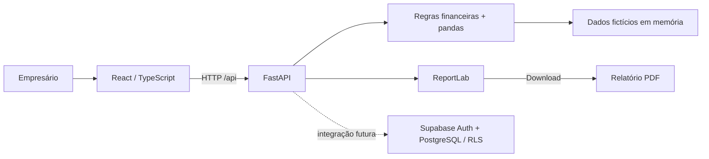

# Lucra — clareza para decidir melhor

**Dashboard de análise de margem que mostra quanto realmente sobra de cada venda.**

O Lucra organiza vendas, custos e taxas para ajudar o empresário a identificar produtos que vendem muito, mas geram prejuízo, entender as deduções que reduzem o resultado e simular condições de pagamento antes de fechar uma venda.

[](https://github.com/Matheus-27mm/data_expert/actions/workflows/ci.yml)

**[Acessar demonstração](https://dataexpert-eight.vercel.app)** · **[Repositório](https://github.com/Matheus-27mm/data_expert)** · **[Documentação da API](https://dataexpert-eight.vercel.app/api/docs)**

> **Estado atual: MVP demonstrativo.** A aplicação utiliza empresa e vendas fictícias, com cálculos funcionais e exportação de PDF. A estrutura para Supabase está preparada, mas autenticação, persistência de dados reais e importação de vendas ainda não estão integradas.

## Sumário

- [1. Visão do produto](#1-visão-do-produto)
- [2. Funcionalidades](#2-funcionalidades)
- [3. Tecnologias e arquitetura](#3-tecnologias-e-arquitetura)
- [4. Estrutura do repositório](#4-estrutura-do-repositório)
- [5. Início rápido com Docker](#5-início-rápido-com-docker)
- [6. Ambiente de desenvolvimento](#6-ambiente-de-desenvolvimento)
- [7. Configuração](#7-configuração)
- [8. Dados demonstrativos](#8-dados-demonstrativos)
- [9. Regras de cálculo](#9-regras-de-cálculo)
- [10. Referência da API](#10-referência-da-api)
- [11. Relatórios em PDF](#11-relatórios-em-pdf)
- [12. Supabase e modelo de dados](#12-supabase-e-modelo-de-dados)
- [13. Publicação na Vercel](#13-publicação-na-vercel)
- [14. Testes e integração contínua](#14-testes-e-integração-contínua)
- [15. Fluxo de colaboração](#15-fluxo-de-colaboração)
- [16. Solução de problemas](#16-solução-de-problemas)
- [17. Limitações e próximos passos](#17-limitações-e-próximos-passos)

## 1. Visão do produto

Uma empresa pode apresentar bom faturamento e perder dinheiro em determinadas vendas. Considerar somente preço e custo do produto esconde o impacto de impostos, comissões e taxas do cartão, especialmente quando há antecipação de recebíveis.

O Lucra responde a quatro perguntas:

1. **Quanto vendemos?** Receita e quantidade de unidades no período.
2. **Quanto parece que lucramos?** Receita menos o custo das mercadorias.
3. **Quanto sobra após as deduções?** Resultado após impostos, cartão e comissões.
4. **Essa próxima venda vale a pena?** Simulação de preço, custo e parcelamento.

Na demonstração mensal, uma estimativa de **R$ 45.000,00** se transforma em **R$ 18.200,00** após as deduções consideradas.

> O indicador representa o resultado das vendas antes de despesas fixas. Não é saldo bancário, lucro contábil ou apuração fiscal.

## 2. Funcionalidades

| Recurso | Comportamento | Estado |
| --- | --- | --- |
| Visão geral | Cards de receita, lucro estimado, resultado e deduções | Implementado |
| Lucro ilusório vs. real | Comparação dos resultados e evolução acumulada | Implementado |
| Deduções | Impostos, cartão/antecipação e comissões | Implementado |
| Produtos e margens | Busca por nome ou categoria; ordenação por unidades vendidas | Implementado |
| Itens no prejuízo | Destaque para grupos de produtos com resultado negativo | Implementado |
| Cascata | Exemplo de uma venda de R$ 100 que deixa R$ 8 | Implementado; exemplo fixo |
| Simulador | Preço, CMV, parcelas e taxas editáveis, com cálculo pela API | Implementado |
| Filtros | Dia, semana ou mês, definidos por uma data de referência | Implementado |
| Relatórios | Download de PDF com o período selecionado | Implementado |
| Responsividade | Colunas adaptáveis e navegação inferior no celular | Implementado |
| Estados da interface | Carregamento, erro, ausência de vendas e busca sem resultado | Implementado |
| Docker | Imagem com frontend e backend, healthcheck e Compose | Implementado |
| Vercel | Frontend estático e API Python no mesmo domínio | Configurado |
| GitHub Actions | Build frontend, testes backend e verificação Docker | Configurado |
| Supabase | Migração com RLS e adaptador de leitura | Preparado; fora do fluxo atual |
| Login e dados reais | Autenticação, autorização e persistência | Pendente |
| Importação e cadastro | Upload de CSV e edição de vendas/produtos | Pendente |

As telas compartilham o período selecionado. O simulador é independente: alterar suas taxas não modifica as vendas fictícias, os indicadores ou o PDF.

## 3. Tecnologias e arquitetura

| Camada | Tecnologia | Responsabilidade |
| --- | --- | --- |
| Interface | React 19 + TypeScript 5 | Componentes, estados e interação |
| Build frontend | Vite 6 | Servidor local, proxy e bundle de produção |
| Estilos e ícones | CSS responsivo + Lucide React | Layout e identidade visual |
| API | Python + FastAPI + Pydantic | Rotas HTTP e validação de entrada |
| Análise | pandas | Filtros, agrupamentos e agregações |
| PDF | ReportLab | Geração do relatório no backend |
| Integração HTTP | HTTPX | Adaptador Supabase e testes da API |
| Testes | pytest | Verificação de cálculos e endpoints |
| Banco previsto | Supabase/PostgreSQL | Empresas e vendas com políticas de acesso |
| Containers | Docker + Docker Compose | Execução do sistema completo |
| Entrega | GitHub Actions + Vercel | Validação automatizada e publicação |

Node.js **22** e Python **3.12** são as referências do CI e do Docker. O JavaScript utiliza `package-lock.json`; os requisitos Python utilizam intervalos de versão.



### Fluxo dos dados

1. O backend gera uma base determinística com `demo_sales()` ao carregar a aplicação.
2. O React envia período e data para `/api/dashboard`.
3. `summarize()` filtra vendas e produz totais, grupos de produtos e valores diários.
4. O React formata a moeda e acumula a série diária no gráfico.
5. A exportação chama `/api/reports/pdf`, reutilizando a mesma função de resumo.
6. O simulador envia suas premissas a `/api/simulate` e recebe deduções e resultado por unidade.

### Ambientes

| Ambiente | Frontend | Backend | Endereço principal |
| --- | --- | --- | --- |
| Desenvolvimento | Vite na porta 5173 | Uvicorn na porta 8000 | `http://127.0.0.1:5173` |
| Docker local | Build servido pelo FastAPI | Mesmo container, porta interna 8000 | `http://127.0.0.1:8080` |
| Vercel | Arquivos estáticos de `dist` | Função Python via `api/index.py` | `https://dataexpert-eight.vercel.app` |

Em desenvolvimento, `vite.config.ts` encaminha `/api` para a porta 8000. No Docker e na Vercel, frontend e API utilizam a mesma origem.

## 4. Estrutura do repositório

```text
data_expert/
├── .github/workflows/ci.yml         # Validações do GitHub Actions
├── api/index.py                    # Entrypoint ASGI da Vercel
├── backend/
│   ├── __init__.py
│   ├── main.py                     # Rotas, modelos e arquivos estáticos
│   ├── finance.py                  # Dados demonstrativos e cálculos
│   ├── report.py                   # Composição do PDF
│   ├── supabase_repository.py      # Adaptador de leitura futura
│   ├── test_finance.py             # Testes de cálculo e API
│   └── requirements.txt            # Dependências de desenvolvimento/testes
├── src/
│   ├── main.tsx                    # Telas, componentes e chamadas à API
│   └── styles.css                  # Estilos e responsividade
├── supabase/migrations/
│   └── 001_initial.sql             # Tabelas, índice e políticas RLS
├── .dockerignore                   # Exclusões do contexto Docker
├── .env.example                    # Exemplo da configuração Supabase
├── .gitignore                      # Exclusões do Git
├── .python-version                 # Versão Python para deploy
├── .vercelignore                   # Exclusões de upload
├── compose.yaml                    # Serviço Docker local
├── Dockerfile                      # Build em etapas: Node e Python
├── index.html                      # HTML inicial
├── package.json                    # Dependências e scripts frontend
├── package-lock.json               # Versões resolvidas pelo npm
├── requirements.txt                # Dependências Python de execução
├── tsconfig.json                   # Configuração TypeScript
├── vercel.json                     # Build, função e reescrita de rotas
├── vite.config.ts                  # Vite e proxy local
└── README.md
```

`node_modules`, `dist`, `.venv`, `.vercel`, caches, arquivos `.env`, `tmp` e `output` não são versionados. `.env.example` contém somente valores ilustrativos.

## 5. Início rápido com Docker

Executa a aplicação completa sem exigir Node ou Python instalados diretamente na máquina.

### Pré-requisitos

- Git.
- Docker Desktop iniciado com containers Linux, ou Docker Engine com Compose.
- Porta local `8080` livre.

### Iniciar

```bash
git clone https://github.com/Matheus-27mm/data_expert.git
cd data_expert
docker compose up -d --build
```

Se o repositório já estiver clonado, execute apenas o último comando na pasta existente.

- Dashboard: [http://127.0.0.1:8080](http://127.0.0.1:8080).
- Saúde: [http://127.0.0.1:8080/api/health](http://127.0.0.1:8080/api/health).
- Swagger: [http://127.0.0.1:8080/api/docs](http://127.0.0.1:8080/api/docs).

### Operação

| Ação | Comando |
| --- | --- |
| Consultar estado e saúde | `docker compose ps` |
| Acompanhar logs | `docker compose logs -f dashboard` |
| Consultar últimos logs | `docker compose logs --tail 100 dashboard` |
| Parar sem remover o container | `docker compose stop` |
| Iniciar container existente | `docker compose start` |
| Recriar após alterar código | `docker compose up -d --build` |
| Parar e remover containers e rede deste projeto | `docker compose down` |

### Funcionamento da imagem

- `node:22-alpine` instala dependências com `npm ci` e compila o React.
- `python:3.12-slim` instala os requisitos de execução e recebe backend e `dist`.
- O processo roda como `appuser`, sem privilégios de root.
- `STATIC_DIR=/app/dist` habilita os arquivos estáticos no FastAPI.
- O healthcheck consulta `/api/health` a cada 30 segundos, com timeout de 5 segundos, período inicial de 15 segundos e limite de 3 falhas.
- O Compose configura `restart: unless-stopped` e `init: true`.

A imagem se chama `lucra-dashboard:local`. O mapeamento `127.0.0.1:8080:8000` permite acesso somente pela própria máquina. Não existem volumes ou banco no Compose atual: os dados fictícios são recriados em memória.

> Construir a imagem local não a publica em um registry. Não há envio automático para Docker Hub ou GHCR. Hospedar em outro servidor exige configurar o destino, acesso de rede e HTTPS.

## 6. Ambiente de desenvolvimento

### Pré-requisitos

Git, Node.js 22, npm, Python 3.12, pip e portas `5173` e `8000` disponíveis.

### 6.1. Clonar e instalar o frontend

```bash
git clone https://github.com/Matheus-27mm/data_expert.git
cd data_expert
npm ci
```

### 6.2. Criar um ambiente Python isolado

**Windows / PowerShell:**

```powershell
py -3.12 -m venv .venv
.\.venv\Scripts\python.exe -m pip install -r backend/requirements.txt
```

Se `py` não estiver disponível, use `python -m venv .venv` após confirmar a versão com `python --version`. Usar o executável do ambiente diretamente evita a necessidade de alterar a política de execução do PowerShell.

**Linux / macOS:**

```bash
python3.12 -m venv .venv
.venv/bin/python -m pip install -r backend/requirements.txt
```

### 6.3. Iniciar a API

Mantenha este terminal aberto, na raiz do projeto.

**Windows / PowerShell:**

```powershell
.\.venv\Scripts\python.exe -m uvicorn backend.main:app --reload --host 127.0.0.1 --port 8000
```

**Linux / macOS:**

```bash
.venv/bin/python -m uvicorn backend.main:app --reload --host 127.0.0.1 --port 8000
```

### 6.4. Iniciar a interface

Em outro terminal, também na raiz:

```bash
npm run dev
```

Abra [http://127.0.0.1:5173](http://127.0.0.1:5173). A documentação da API fica em [http://127.0.0.1:8000/api/docs](http://127.0.0.1:8000/api/docs). Use `Ctrl+C` em cada terminal para encerrar os processos.

### Scripts frontend

| Comando | Finalidade |
| --- | --- |
| `npm run dev` | Inicia o Vite com atualização durante o desenvolvimento |
| `npm run build` | Verifica TypeScript e gera `dist` |
| `npm run preview` | Visualiza o bundle compilado; não inicia a API |

O frontend depende da API para os indicadores e o simulador. Para validar a aplicação compilada completa, prefira Docker, que serve frontend e backend na mesma origem.

## 7. Configuração

**Nenhuma variável de ambiente é necessária para executar a demonstração.**

| Variável | Uso | Estado |
| --- | --- | --- |
| `STATIC_DIR` | Diretório do frontend compilado a servir pelo FastAPI | Definida no Docker como `/app/dist` |
| `SUPABASE_URL` | URL do projeto utilizada pelo adaptador | Integração futura |
| `SUPABASE_PUBLISHABLE_KEY` | Chave pública utilizada pelo adaptador | Integração futura |

O backend **não carrega um arquivo `.env` automaticamente**. O adaptador consulta `os.environ`; preencher `.env` não ativa a integração. Será necessário injetar variáveis no processo ou implementar seu carregamento quando o banco for conectado.

No desenvolvimento, CORS permite `http://localhost:5173` e `http://127.0.0.1:5173`, com métodos `GET` e `POST`. O frontend usa caminhos relativos `/api`. Se interface e API forem separadas em domínios diferentes, suas configurações precisarão ser revistas.

## 8. Dados demonstrativos

A empresa fictícia é a **Casa Nova Store**. A base possui 6 produtos e 960 registros, cada um com uma unidade: 480 vendas em julho de 2026 e 480 em agosto de 2026. Os valores mensais são iguais e distribuídos deterministicamente pelos dias.

A data inicial selecionada é **31/08/2026**, no período mensal.

### Resultado de cada mês

| Indicador | Valor |
| --- | ---: |
| Faturamento | R$ 150.000,00 |
| CMV | R$ 105.000,00 |
| Lucro estimado | R$ 45.000,00 |
| Impostos estimados | R$ 9.000,00 |
| Cartão e antecipação | R$ 12.000,00 |
| Comissões | R$ 5.800,00 |
| Deduções após CMV | R$ 26.800,00 |
| Resultado das vendas | **R$ 18.200,00** |
| Margem de contribuição | **12,13%** |

### Produtos com prejuízo no mês

| Produto | Unidades | Parcelas | Margem | Resultado |
| --- | ---: | ---: | ---: | ---: |
| Fone Bluetooth Pulse | 120 | 12x | -12% | -R$ 2.880,00 |
| Smartwatch Connect | 90 | 12x | -13% | -R$ 2.340,00 |
| Caixa de Som Mini | 80 | 10x | -10% | -R$ 1.600,00 |

### Períodos

| Seleção | Intervalo considerado |
| --- | --- |
| Diário | Somente a data de referência |
| Semanal | Segunda-feira a domingo da semana que contém a data |
| Mensal | Primeiro ao último dia do mês da data |

Os limites são inclusivos. Uma semana pode atravessar meses: `31/08/2026` considera `31/08/2026` a `06/09/2026`. Dias sem registros recebem valores zerados. Fora da base demonstrativa, o dashboard apresenta totais zerados e lista de produtos vazia.

## 9. Regras de cálculo

### 9.1. Unidades e arredondamento

Os valores monetários da base e das respostas da API são **inteiros em centavos**. `1820000` representa `R$ 18.200,00`.

O simulador recebe preço e custo em **reais**, com até duas casas decimais, e os converte para centavos. Taxas são percentuais: `6` significa `6%`.

As deduções monetárias usam `ROUND_HALF_UP`. O preço de equilíbrio é arredondado para cima. A interface formata moeda em `pt-BR` e pode exibir percentuais com menos casas decimais que a API.

### 9.2. Dashboard

```text
Lucro estimado = receita - CMV
Deduções = impostos + cartão/antecipação + comissões
Resultado das vendas = lucro estimado - deduções
Margem (%) = resultado das vendas / receita × 100
```

Sem receita, a margem retornada é zero. Os produtos são agrupados por nome, categoria e parcelas, ordenados por unidades vendidas decrescentes; em empate, pelo resultado crescente.

O campo `daily` contém valores de cada dia. O gráfico React acumula esses valores dentro do período selecionado.

### 9.3. Simulador

| Premissa padrão | Valor |
| --- | ---: |
| Imposto | 6% |
| Comissão | 4% |
| Cartão / MDR | 2% |
| Antecipação | 1,5% ao mês |

```text
Prazo médio = (número de parcelas + 1) / 2
Taxa total de cartão (%) = MDR + antecipação mensal × prazo médio
Dedução de cada taxa = preço de venda × taxa / 100
Resultado = preço - CMV - imposto - comissão - cartão
Preço de equilíbrio = CMV / (1 - soma das taxas / 100)
```

O modelo considera a primeira parcela em 30 dias e utiliza uma aproximação linear. Contratos reais podem adotar outro cálculo. Com soma de taxas igual ou superior a 100%, a API retorna `breakeven: null`.

**Exemplo:** preço de R$ 200,00, custo de R$ 180,00 e 12 parcelas com taxas padrão:

| Etapa | Resultado |
| --- | ---: |
| Prazo médio | 6,5 meses |
| Taxa total de cartão | 11,75% |
| Imposto | R$ 12,00 |
| Cartão e antecipação | R$ 23,50 |
| Comissão | R$ 8,00 |
| Resultado por unidade | **-R$ 23,50** |
| Margem | **-11,75%** |
| Preço de equilíbrio calculado | **R$ 230,04** |

O equilíbrio é uma referência matemática: arredondamentos individuais podem produzir diferenças de centavos. Ele não inclui despesas fixas ou uma margem desejada.

### 9.4. Cascata

O waterfall é um exemplo fixo, identificado como independente do período:

```text
R$ 100 de venda
- R$ 60 de CMV
- R$  6 de impostos
- R$ 22 de cartão
- R$  4 de comissão
= R$  8 de resultado
```

Essas taxas não são as taxas padrão do simulador nem as taxas agregadas do mês demonstrativo.

## 10. Referência da API

- Swagger UI: `/api/docs`.
- ReDoc: `/api/redoc`.
- OpenAPI: `/api/openapi.json`.

As rotas atuais são públicas e trabalham apenas com dados fictícios. Não existe cadastro ou escrita de vendas pela API.

| Método | Rota | Finalidade |
| --- | --- | --- |
| `GET` | `/api/health` | Saúde da aplicação |
| `GET` | `/api/dashboard` | Indicadores, produtos e série diária |
| `POST` | `/api/simulate` | Simulação de uma venda |
| `GET` | `/api/reports/pdf` | Relatório do período |

### 10.1. Saúde

```http
GET /api/health
```

```json
{"status":"ok","mode":"demo"}
```

Confirma que a API responde; não testa Supabase, pois o banco não está conectado.

### 10.2. Dashboard

```http
GET /api/dashboard?period=monthly&anchor=2026-08-31
```

| Parâmetro | Valores | Padrão |
| --- | --- | --- |
| `period` | `daily`, `weekly` ou `monthly` | `monthly` |
| `anchor` | Data ISO `AAAA-MM-DD` | `2026-08-31` |

| Campo da resposta | Conteúdo |
| --- | --- |
| `start`, `end` | Limites inclusivos em formato ISO |
| `period` | Tipo de período |
| `totals` | Receita, CMV, deduções, quantidade, estimativa, resultado e margem |
| `products` | Grupos com nome, categoria, quantidade, parcelas, receita, resultado e margem |
| `daily` | Dias com `date`, `estimated` e `net` |
| `source` | `demo` na implementação atual |

Objeto `totals` de agosto de 2026:

```json
{
  "revenue": 15000000,
  "cmv": 10500000,
  "tax": 900000,
  "card": 1200000,
  "commission": 580000,
  "quantity": 480,
  "estimated": 4500000,
  "hidden": 2680000,
  "net": 1820000,
  "margin": 12.13
}
```

### 10.3. Simulação

```http
POST /api/simulate
Content-Type: application/json
```

```json
{
  "price": 200,
  "cost": 180,
  "installments": 12,
  "tax_rate": 6,
  "commission_rate": 4,
  "card_base": 2,
  "anticipation_rate": 1.5
}
```

| Campo | Obrigatório | Limites |
| --- | --- | --- |
| `price` | Sim | Maior que zero, até R$ 10.000.000,00; até 2 casas decimais |
| `cost` | Sim | De zero a R$ 10.000.000,00; até 2 casas decimais |
| `installments` | Sim | Inteiro de 1 a 12 |
| `tax_rate` | Não | 0 a 50%; padrão 6 |
| `commission_rate` | Não | 0 a 50%; padrão 4 |
| `card_base` | Não | 0 a 50%; padrão 2 |
| `anticipation_rate` | Não | 0 a 20% ao mês; padrão 1,5 |

Resposta, com moeda em centavos:

```json
{
  "price": 20000,
  "cost": 18000,
  "tax": 1200,
  "commission": 800,
  "card": 2350,
  "net": -2350,
  "margin": -11.75,
  "card_rate": 11.75,
  "breakeven": 23004
}
```

Entradas fora dos tipos ou limites recebem HTTP `422`, com detalhes de validação. Resultado financeiro negativo é uma resposta válida, com HTTP `200`.

### 10.4. Exemplos no PowerShell

```powershell
# Docker local. Para desenvolvimento, troque 8080 por 8000.
$lucraBaseUrl = 'http://127.0.0.1:8080'

Invoke-RestMethod "$lucraBaseUrl/api/health"
Invoke-RestMethod "$lucraBaseUrl/api/dashboard?period=monthly&anchor=2026-08-31"

$lucraSimulation = @{
    price = 200
    cost = 180
    installments = 12
} | ConvertTo-Json

Invoke-RestMethod -Method Post -Uri "$lucraBaseUrl/api/simulate" -ContentType 'application/json' -Body $lucraSimulation
```

## 11. Relatórios em PDF

Na interface, selecione período e data e use **Exportar relatório**. A tela **Relatórios** oferece o mesmo download.

```http
GET /api/reports/pdf?period=monthly&anchor=2026-08-31
```

A resposta utiliza `Content-Type: application/pdf` e `Content-Disposition: attachment`. O nome segue `lucra-{period}-{anchor}.pdf`.

O documento inclui empresa e intervalo, resumo financeiro, produtos no prejuízo, comentário sobre deduções, metodologia, limitações e paginação.

O PDF usa os mesmos dados agregados do dashboard. Não inclui a simulação digitada pelo usuário nem reproduz os gráficos da interface. É gerado em memória e enviado na resposta, sem armazenamento permanente pelo backend.

```powershell
New-Item -ItemType Directory -Force output/pdf | Out-Null
Invoke-WebRequest -Uri 'http://127.0.0.1:8080/api/reports/pdf?period=monthly&anchor=2026-08-31' -OutFile 'output/pdf/lucra-mensal-agosto-2026.pdf'
```

## 12. Supabase e modelo de dados

### Estado da integração

O dashboard **ainda não consulta Supabase**. A migração e o adaptador estão preparados para a próxima etapa. Configurar credenciais não substitui automaticamente a base fictícia.

### Tabelas

| Tabela | Campos | Finalidade |
| --- | --- | --- |
| `companies` | `id`, `name`, `owner_id` | Empresa vinculada a `auth.users` |
| `sales` | `id`, `company_id`, `sold_on`, `product`, `category`, `quantity`, `revenue`, `cmv`, `tax`, `card`, `commission`, `installments` | Vendas e deduções |

Campos monetários são `bigint` em centavos e representam **totais do registro**, não valores unitários a multiplicar novamente por `quantity`. Valores financeiros não podem ser negativos; quantidade deve ser positiva e parcelas devem estar entre 1 e 12. Há um índice em `(company_id, sold_on)`.

### Acesso e adaptador

A migração habilita Row Level Security nas duas tabelas. As políticas restringem usuários autenticados às empresas que possuem e às respectivas vendas.

`load_company_sales(company_id, user_access_token)`:

1. Lê URL e chave pública do ambiente.
2. Valida a sessão consultando `/auth/v1/user`.
3. Consulta vendas da empresa com o token do usuário, preservando RLS.
4. Lê páginas de até 1.000 registros, ordenadas por ID, até receber uma página vazia.
5. Retorna um DataFrame com as colunas esperadas pela análise.

Não utiliza chave `service_role`, não cadastra registros e não está conectado às rotas atuais. O modelo não oferece convites ou permissões compartilhadas para colaboradores.

### Etapas para usar dados reais

1. Criar ou escolher um projeto Supabase.
2. Aplicar `supabase/migrations/001_initial.sql` em um banco compatível. Ela cria objetos novos e não é reaplicável sem avaliar os objetos existentes.
3. Implementar login e renovação da sessão na interface.
4. Receber e validar tokens nas rotas.
5. Implementar seleção de empresa e autorização.
6. Conectar o adaptador ao dashboard e ao relatório.
7. Implementar cadastro/importação com validação monetária.
8. Testar o isolamento dos registros entre usuários.

Referência: [Row Level Security no Supabase](https://supabase.com/docs/guides/database/postgres/row-level-security).

## 13. Publicação na Vercel

| Configuração | Valor |
| --- | --- |
| Repositório | `Matheus-27mm/data_expert` |
| Branch de produção utilizada | `main` |
| Pasta raiz | Raiz do repositório |
| Framework | Vite |
| Build | `npm run build` |
| Saída estática | `dist` |
| Entrada Python | `api/index.py` |
| Reescrita | `/api/:path*` → `/api/index` |
| Duração máxima configurada | 60 segundos |
| Requisitos Python | `requirements.txt` da raiz |

`api/index.py` importa `backend.main.app`. A Vercel serve os arquivos estáticos e encaminha a API para a função Python. Mantenha `STATIC_DIR` sem definição nesse ambiente. A pasta `.vercel` contém a associação local da CLI e não deve ser versionada.

### CLI

```bash
npx vercel login
npx vercel
npx vercel --prod
```

O segundo comando publica um preview; o terceiro publica em produção. Confira a conta e o projeto selecionados. A conexão Git foi configurada para este repositório e permite publicar alterações enviadas à branch de produção.

### Verificação após publicar

- Página inicial: dashboard carregado.
- `/api/health`: `status: ok`.
- `/api/dashboard?period=monthly&anchor=2026-08-31`: `net: 1820000`.
- `/api/docs`: documentação acessível.
- `/api/reports/pdf?period=monthly&anchor=2026-08-31`: PDF válido.
- Simulador: testar uma venda, pois utiliza `POST`.

### Trocar o repositório

Após criar o destino e definir como preservar seu histórico:

```bash
git remote -v
git remote set-url origin https://github.com/SEU_USUARIO/NOVO_REPOSITORIO.git
git push -u origin main
```

Atualize **Settings → Git** na Vercel, as permissões do novo repositório, os links e o badge deste README. Não use push forçado para contornar divergências sem analisar o histórico.

O código não depende de uma organização específica. A elegibilidade do repositório e os limites devem ser conferidos nas condições vigentes do plano utilizado.

Referência: [runtime Python da Vercel](https://vercel.com/docs/functions/runtimes/python).

## 14. Testes e integração contínua

### Comandos locais

```bash
npm run build
```

**Windows:**

```powershell
.\.venv\Scripts\python.exe -m pytest backend -q
```

**Linux/macOS:**

```bash
.venv/bin/python -m pytest backend -q
```

### Cobertura atual

Os seis testes verificam:

1. Reconciliação mensal e consistência entre produtos, dias e total.
2. Períodos vazios, filtros, semanas entre meses e fevereiro bissexto.
3. Igualdade entre soma diária e resultado mensal.
4. Simulação negativa e rejeição de entradas inválidas.
5. Ausência de equilíbrio quando as taxas consomem a receita.
6. PDFs dos três períodos e validação de parâmetros do dashboard.

Os testes de PDF conferem assinatura do arquivo e cabeçalhos HTTP; não substituem inspeção visual. Não há suíte automatizada de navegador ou testes de RLS.

### GitHub Actions

O workflow `.github/workflows/ci.yml` roda em `push` e `pull_request`:

| Job | Verificações |
| --- | --- |
| `frontend` | Node 22, `npm ci` e build |
| `backend` | Python 3.12, requisitos e pytest |
| `docker` | Build da imagem, execução, saúde e página inicial |

O teste Docker repete a consulta durante a inicialização e imprime logs em caso de falha. O workflow tem permissão de leitura do repositório e não publica imagens em registries.

**CI e deploy são separados:** GitHub Actions valida; a integração Git da Vercel publica. O workflow atual não obriga a Vercel a aguardar todos os testes antes de publicar.

## 15. Fluxo de colaboração

A partir de uma árvore de trabalho limpa:

```bash
git switch main
git pull --ff-only
git switch -c feat/nome-da-melhoria
```

Depois de implementar e validar:

```bash
git status
git add CAMINHOS_DOS_ARQUIVOS_ALTERADOS
git diff --cached
git commit -m "feat: descreva a melhoria"
git push -u origin feat/nome-da-melhoria
```

Substitua os caminhos e o nome da branch. Abra um pull request e acompanhe os checks e o deploy de preview correspondente.

Ao contribuir:

- Mantenha cálculos no backend e reutilize-os no dashboard e no PDF.
- Preserve o contrato monetário: centavos nas respostas, reais na entrada do simulador.
- Atualize testes ao alterar cálculos, períodos e validações.
- Confira celular e desktop ao modificar layout.
- Documente alterações de API, configuração e execução.
- Não inclua credenciais, dados reais de clientes, ambientes virtuais ou builds no commit.

O repositório não possui arquivo de licença. A licença de distribuição ainda precisa ser definida pelos responsáveis pelo projeto.

## 16. Solução de problemas

| Sintoma | Causa provável | Verificação ou solução |
| --- | --- | --- |
| Interface não carrega dados | API desligada | Inicie Uvicorn na porta 8000 e consulte `/api/health` |
| Vite usa outra porta | Porta 5173 ocupada | Confira a URL impressa; revise as origens se alterar a configuração |
| Indicadores zerados | Data fora da base fictícia | Selecione agosto de 2026, período mensal |
| Simulação retorna `422` | Entrada fora dos limites | Confira o corpo de erro e a tabela da API |
| Venda dá prejuízo | Custos superam o preço | Revise as premissas; resultado negativo não é erro técnico |
| Docker não conecta ao engine | Docker parado | Inicie Docker Desktop/Engine e execute `docker info` |
| Porta 8080 ocupada | Outro serviço na porta | Troque o mapeamento por `127.0.0.1:8081:8000` em `compose.yaml` e recrie |
| Alteração não aparece no Docker | Imagem anterior | Execute `docker compose up -d --build` |
| `ModuleNotFoundError` | Dependências em outro Python | Instale e execute pelo mesmo executável de `.venv` |
| Falha com `STATIC_DIR` | Diretório inexistente | Gere o build e use caminho válido; não defina a variável com Vite |
| Site abre, mas API publicada falha | Função ou rewrite | Confira `vercel.json` e logs da Vercel |
| `/docs` retorna `404` | Documentação sob prefixo API | Use `/api/docs` |
| PDF não baixa | Erro ou indisponibilidade da API | Teste a rota diretamente e consulte logs |
| `.env` não conecta Supabase | Integração pendente | Não há troca automática da fonte; siga a seção Supabase |

Ao relatar problemas, informe ambiente, período/data, comando e mensagem de erro. Não compartilhe tokens ou dados sensíveis em logs e issues.

## 17. Limitações e próximos passos

### Limitações atuais

- Dados fictícios em memória, sem persistência, importação ou conciliação bancária.
- Sem autenticação nas rotas públicas do MVP.
- Resultado anterior a aluguel, folha e demais despesas fixas.
- Sem devoluções, estornos, estoque ou contas a pagar/receber.
- Imposto ilustrativo, sem apuração do Simples por anexo/faixa.
- Antecipação simplificada; não substitui regras da adquirente.
- Cascata fixa, independente do período.
- Navegação por estado React, sem URL individual para cada tela.
- Empresa e identificação de administradores demonstrativas.
- PDF sob demanda, sem histórico, agendamento ou envio automático.
- Sem publicação de imagem em registry ou hospedagem Docker remota.

### Evolução sugerida

- [ ] Autenticação Supabase e seleção de empresa.
- [ ] Persistência nas rotas e testes de isolamento RLS.
- [ ] Importação de CSV com prévia, validação e identificação de duplicidades.
- [ ] Cadastro de produtos, custos, vendas e condições de pagamento.
- [ ] Despesas fixas e resultado operacional.
- [ ] Conciliação de recebíveis, devoluções e estornos.
- [ ] Cascata calculada com os dados do período.
- [ ] Histórico e agendamento de relatórios.
- [ ] Testes de navegador, acessibilidade e exportação completa.
- [ ] Backup, observabilidade e configuração de produção para dados reais.

Esses itens são possibilidades de evolução, não funcionalidades disponíveis nem compromissos de prazo.
